# System Architecture Diagrams

## National Climate Transparency Platform Architecture

---

## 1. High-Level Architecture

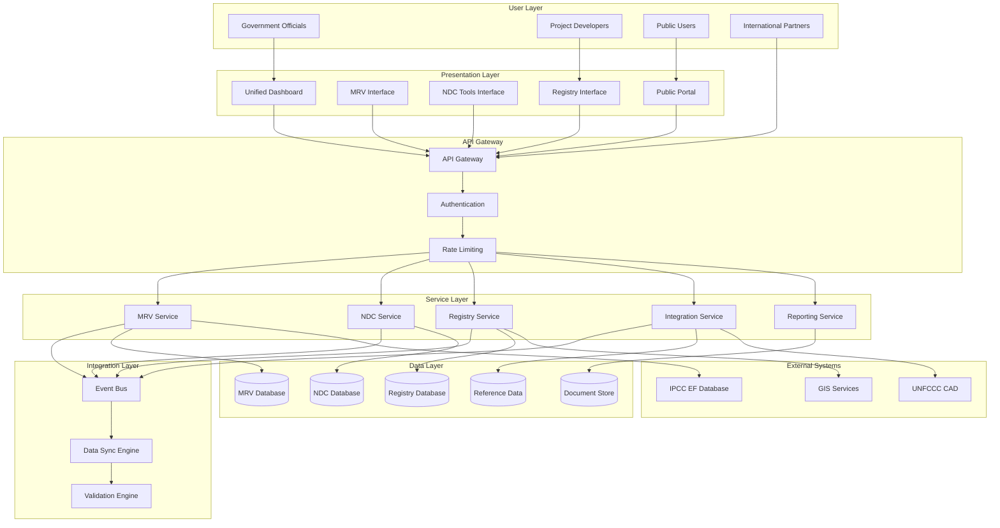

---

## 2. MRV System Architecture

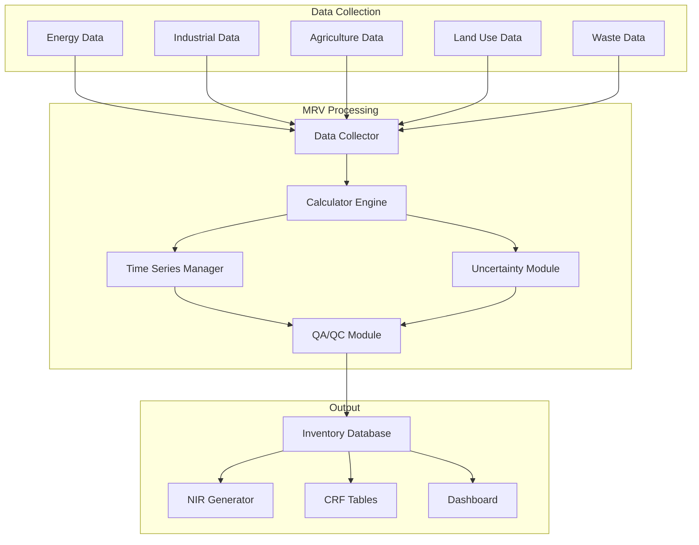

### MRV Data Flow

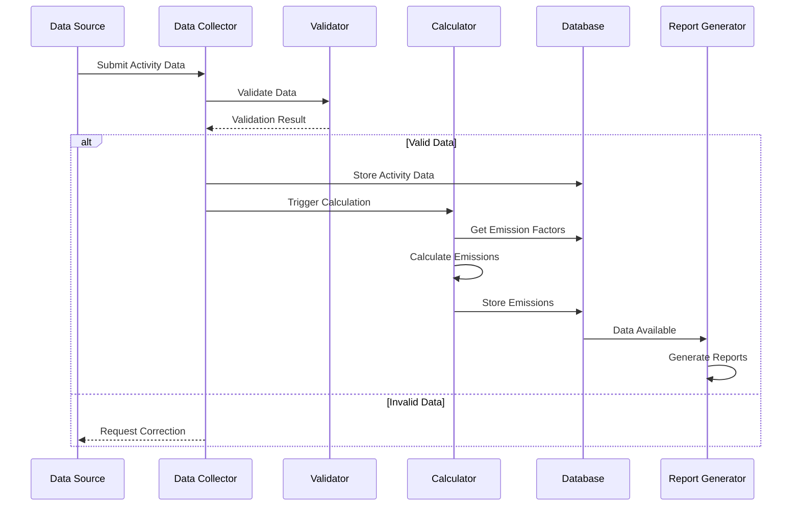

---

## 3. NDC Tools Architecture

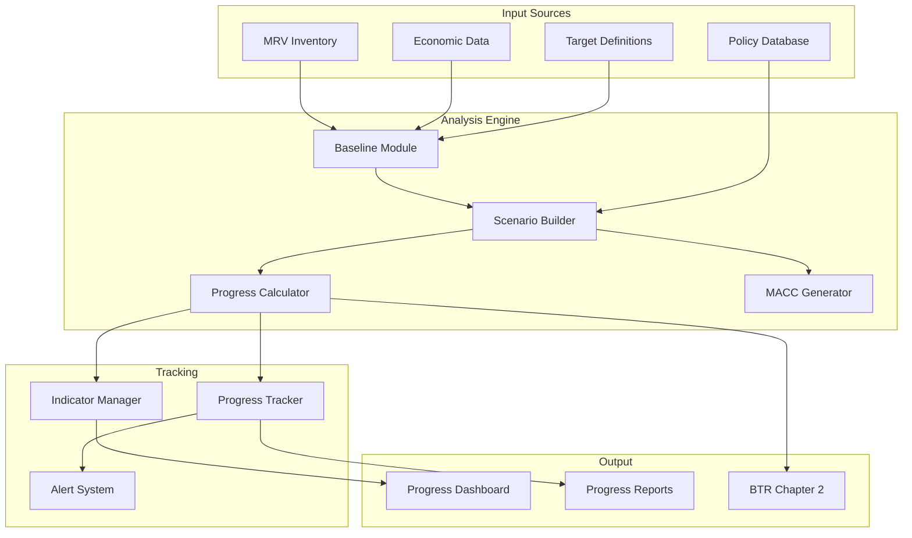

### NDC Progress Calculation Flow

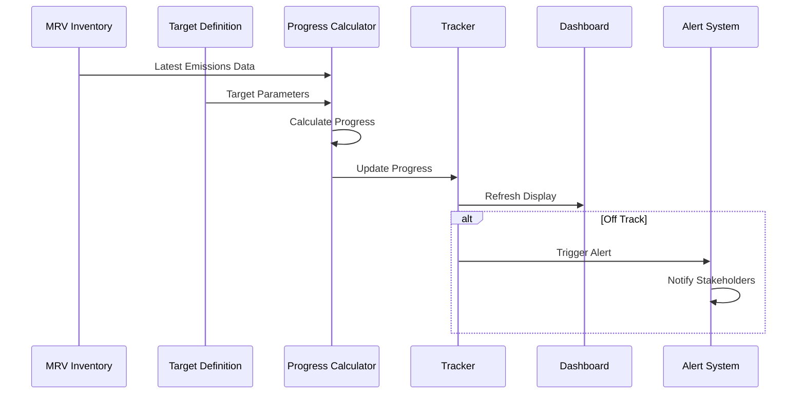

---

## 4. Carbon Registry Architecture

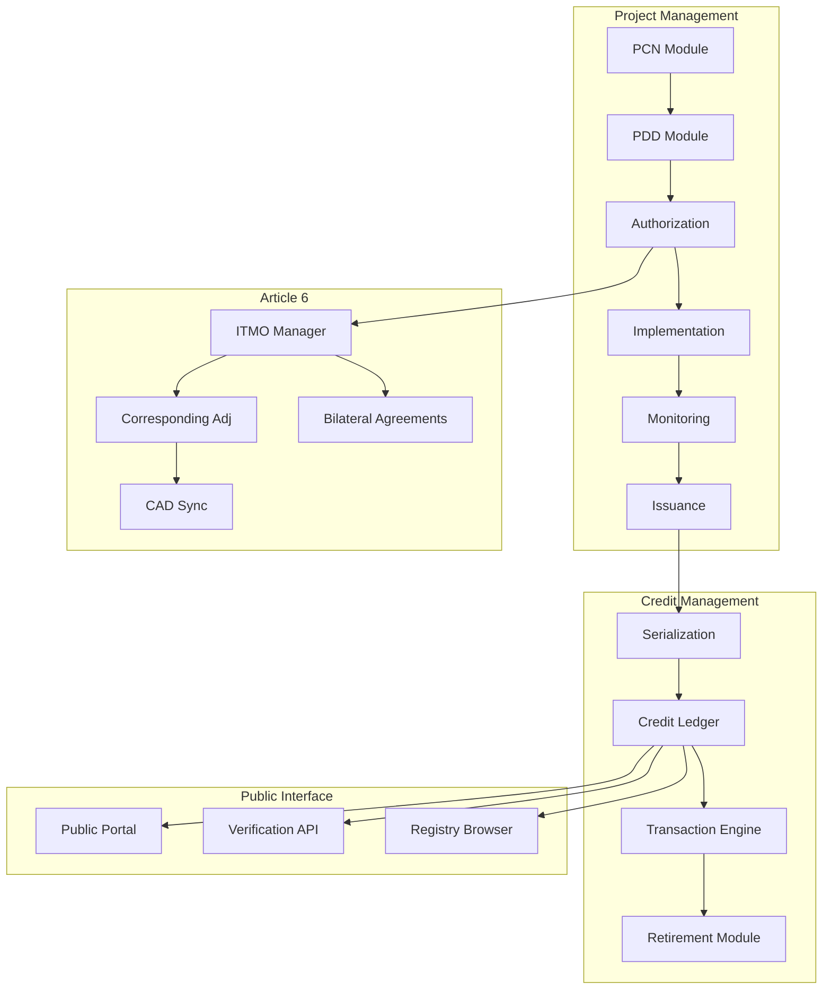

### Credit Lifecycle Flow

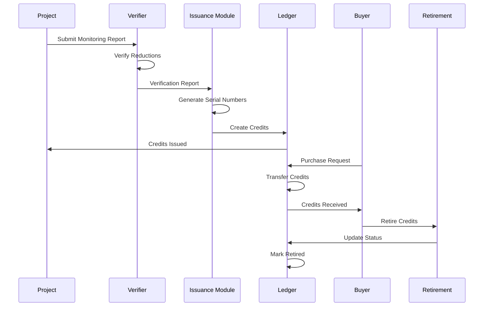

---

## 5. Integration Architecture

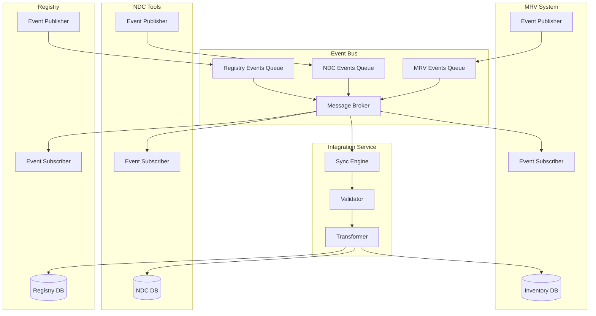

### Cross-System Event Flow

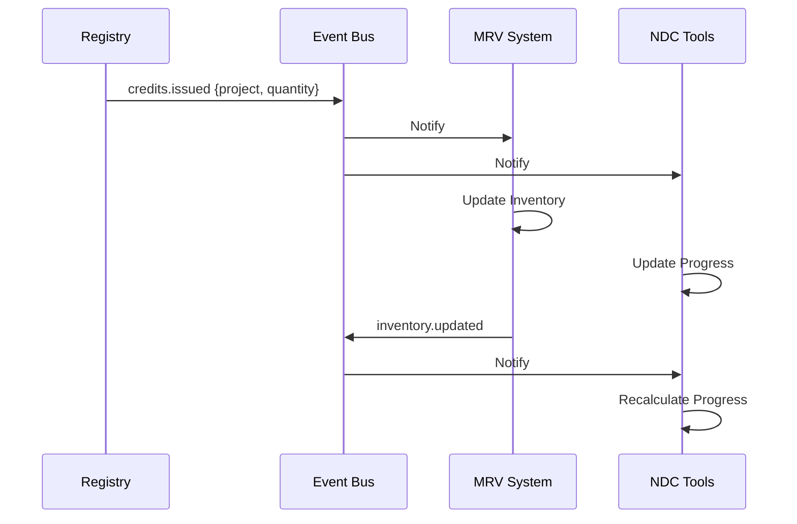

---

## 6. BTR Generation Flow

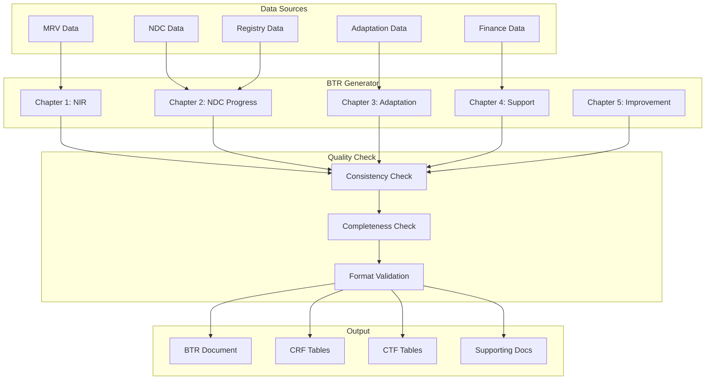

---

## 7. Deployment Architecture

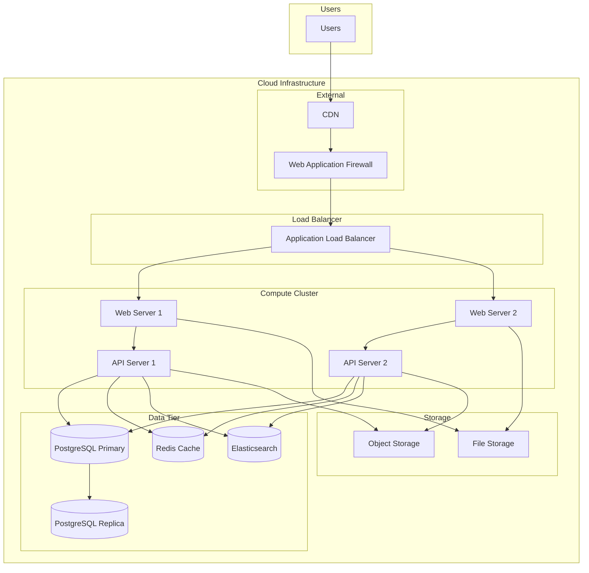

---

## 8. Security Architecture

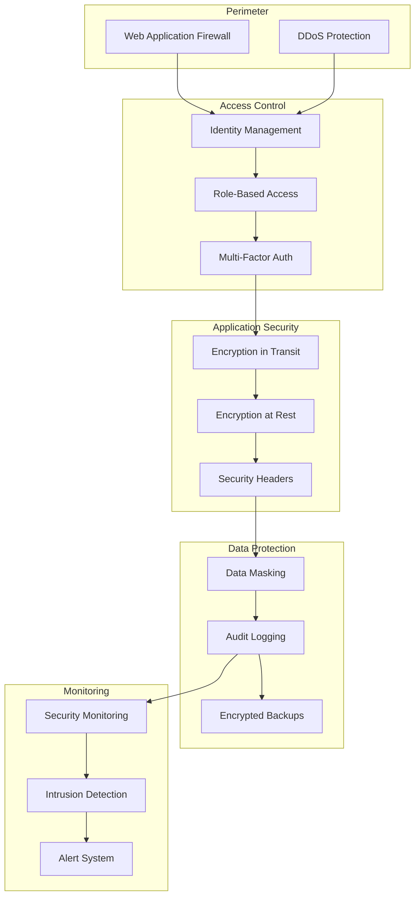

---

## Diagram Legend

| Symbol | Meaning |
|--------|---------|
| Rectangle | Component/Service |
| Cylinder | Database |
| Diamond | Decision Point |
| Arrow | Data/Control Flow |
| Dashed Line | Optional/Async |
| Subgraph | Logical Grouping |
